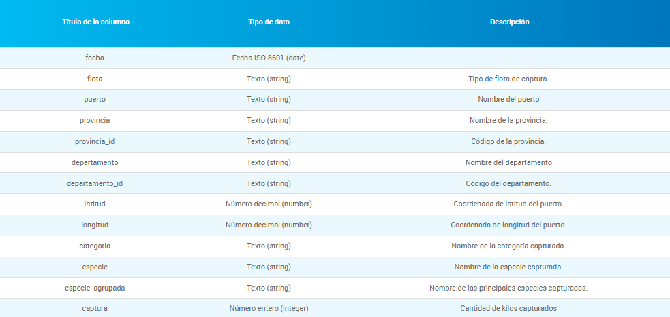

# Detección de anomalías en las capturas pesqueras argentinas

**Aprendizaje Automático** · **Grupo 12**

**Integrantes:**

- Bernal, Alejandro Matias
- Paredes, Sebastian Pablo
- Rodrigues, David Ezequiel
- Barnetche, Iñaki Francisco

## Contexto y problema

La pesca marítima es una actividad económica importante para Argentina. Cada mes se registran desembarques en distintos puertos del litoral marítimo, con especies, flotas y volúmenes muy diferentes entre sí. Estos registros son publicados como datos abiertos por el Ministerio de Agricultura, Ganadería y Pesca.

Al revisar los datos observamos que las capturas varían mucho según la especie, el puerto, el tipo de flota y el momento del año. Por eso una captura alta o baja no indica por sí sola que haya ocurrido algo fuera de lo normal: lo que es habitual para una especie en un puerto puede ser excepcional para otra.

Poder anticipar que la captura de una especie en un puerto se va a apartar de su comportamiento habitual tiene varios usos posibles:

- Alertar con tiempo sobre caídas inesperadas en la captura de una especie.
- Detectar cambios en la actividad de determinados puertos.
- Ayudar a planificar producción, almacenamiento y transporte.
- Identificar registros que podrían ser incorrectos.
- Orientar investigaciones sobre presión pesquera o cambios ambientales.

## Planteo del problema

Existen trabajos que abordan este tema como un problema de regresión, prediciendo el volumen de captura mediante modelos de series temporales (por ejemplo, ARIMA). En este trabajo, en cambio, lo planteamos como un problema de clasificación binaria:

**Para cada combinación de especie y puerto, y utilizando solamente la información disponible hasta el mes, predecir si la captura del mes t será normal o anómala.**

Las dos clases posibles son:

- **Normal:** la captura del mes se encuentra dentro de lo esperable para esa especie, ese puerto y esa época del año.

- **Anómala:** la captura del mes se aparta de manera marcada de ese comportamiento histórico, ya sea por una caída o por un aumento.

Que un mes sea clasificado como anómalo no explica por qué ocurrió. Detrás de una variación puede haber causas estacionales, ambientales, económicas, administrativas o cambios en la actividad de la flota. El objetivo del modelo es señalar esos casos con anticipación para que luego puedan analizarse con más detalle.

## Dataset

Para desarrollar el trabajo vamos a utilizar un conjunto de datos públicos sobre desembarques pesqueros realizados en puertos argentinos.

El archivo principal reúne información desde enero de 2010 hasta diciembre de 2018. Tiene aproximadamente 41.340 registros y 13 variables. Además, contamos con otro archivo correspondiente al año 2019, que más adelante podríamos incorporar al análisis.

Dentro de los datos aparecen 23 puertos, distribuidos en 6 provincias. También encontramos 8 tipos de flota, 89 especies diferentes y 16 agrupaciones de especies.

Nos resulta útil contar con varios años porque permite comparar cómo fue cambiando la captura de una misma especie o de un determinado puerto. También nos da una base histórica más amplia para tratar de definir qué situaciones se alejan de lo esperado.

## Variables principales

Las variables que contiene el dataset son las siguientes:

**fecha:** indica el mes y año al que corresponde el registro.

En una primera etapa creemos que las variables que más vamos a utilizar son ***fecha, puerto, flota, especie, especie agrupada y captura***.

## Acceso al dataset

Los datos fueron obtenidos del portal oficial de Datos Abiertos de Argentina y corresponden a información sobre desembarques pesqueros.

**Fuente:** Datos Argentina / Ministerio de Agricultura, Ganadería y Pesca.

**Enlaces donde se encuentran los 2 dataset:**

[https://datos.magyp.gob.ar/dataset/http-www-magyp-gob-ar-sitio-areas-pesca-maritima-desembarques](https://datos.magyp.gob.ar/dataset/http-www-magyp-gob-ar-sitio-areas-pesca-maritima-desembarques)

**Recurso principal utilizado (desembarques 2010–2018):**

[https://datos.magyp.gob.ar/dataset/http-www-magyp-gob-ar-sitio-areas-pesca-maritima-desembarques/archivo/77a15b4a-71e1-4b81-9732-ae0b6863c8cc](https://datos.magyp.gob.ar/dataset/http-www-magyp-gob-ar-sitio-areas-pesca-maritima-desembarques/archivo/77a15b4a-71e1-4b81-9732-ae0b6863c8cc)

El segundo archivo, con los desembarques de 2019, se encuentra en la misma página del conjunto de datos.

## Limpieza y preprocesamiento

Antes de comenzar a probar modelos necesitamos revisar mejor los datos y preparar algunas variables.

Una de las cosas que encontramos en la primera revisión superficial fueron valores faltantes en las coordenadas con registros sin latitud y longitud.

Como un mismo puerto aparece varias veces dentro del dataset, primero vamos a comprobar si podemos completar esas coordenadas utilizando registros del mismo puerto que sí tengan esos datos. Otra posibilidad es directamente no utilizar latitud y longitud, sobre todo si vemos que trabajar con puerto y provincia ya nos da suficiente información.

También revisaremos la existencia de duplicados.

La fecha también necesita cierto tratamiento. Nos interesa separar el año y el mes porque probablemente sea más útil analizarlos por separado. De esa forma podemos estudiar, por ejemplo, si una especie suele tener determinados niveles de captura durante ciertos meses.

Otro punto que queremos observar es si existen períodos en los que algunas especies o algunos puertos directamente no tengan registros.

Finalmente está la variable **captura**, que probablemente sea una de las más importantes para nuestro análisis. Vamos a buscar valores extremos y posibles inconsistencias, pero teniendo en cuenta que no todas las especies manejan los mismos volúmenes.

Por ejemplo, no tendría mucho sentido fijar un único límite y considerar anómala cualquier captura que lo supere. Primero necesitamos conocer cómo se comportan las distintas especies, puertos y períodos para poder establecer comparaciones más razonables.

### Qué se hará posteriormente

Uno de los puntos que todavía tenemos que resolver es cómo definir exactamente una anomalía.

Actualmente el dataset no tiene una columna que indique si una captura fue normal o anómala. Esa clasificación tendremos que construirla nosotros a partir del comportamiento histórico de los datos.

Una posibilidad es comparar la captura de una determinada especie en un puerto con lo que ocurrió anteriormente en períodos similares. Si el valor se encuentra demasiado alejado de lo que normalmente sucede en ese contexto, podría considerarse un posible caso anómalo.

Todavía tendremos que definir qué criterio vamos a utilizar para establecer ese límite. Esa decisión probablemente surja después de realizar el análisis exploratorio y conocer mejor la distribución de las capturas.

Una vez que tengamos una forma razonable de identificar esos casos, podremos probar modelos de clasificación para ver si es posible distinguir entre registros habituales y registros anómalos.

Por ahora, el objetivo de esta primera etapa es más básico: entender bien el dataset, corregir los problemas que encontremos y dejar los datos preparados para continuar con el análisis.

### Conclusión

Elegimos este dataset principalmente porque tiene varios años de información y permite trabajar con diferentes especies, puertos y tipos de flota.

Antes de pensar directamente en un modelo, necesitamos entender cómo se comportan esos datos. Parte del trabajo va a estar justamente en descubrir qué diferencias son normales y cuáles podrían representar algo fuera de lo habitual.

El paso siguiente será limpiar y explorar el dataset con más profundidad. A partir de eso podremos definir mejor qué vamos a considerar una anomalía y cómo generar la clasificación necesaria para continuar con el trabajo de aprendizaje automático.
