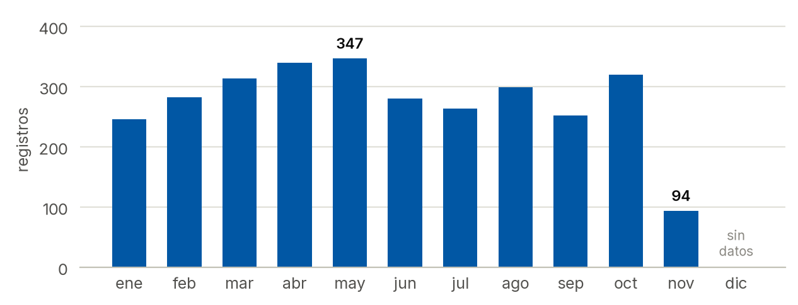
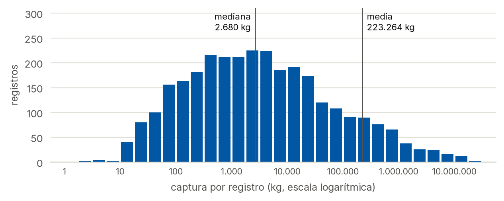
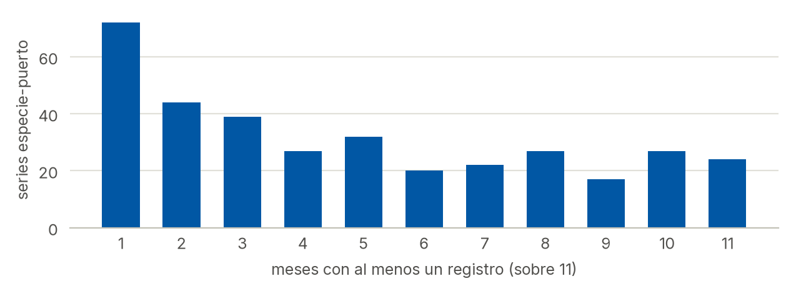
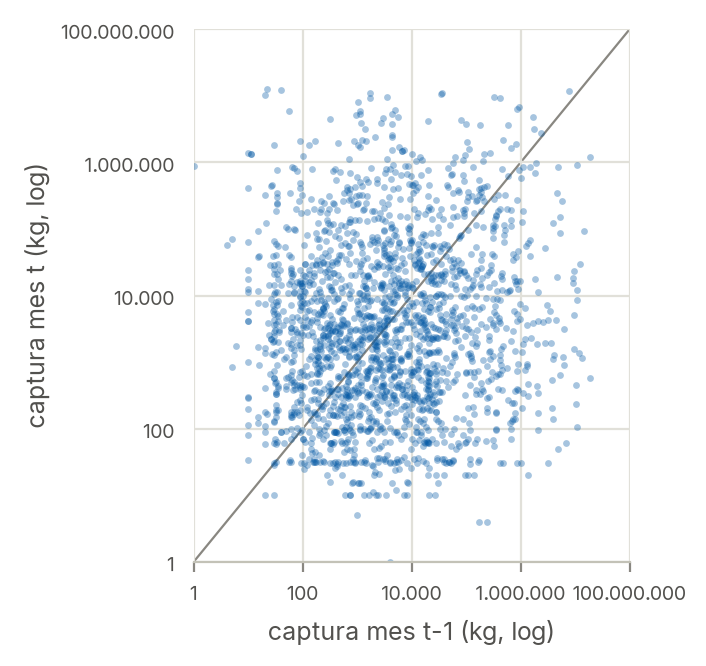

# Perfilado de `captura-puerto-flota-2019.csv`

> Reporte generado automáticamente por `src/perfilado.py`. Describe el archivo tal como fue publicado; no aplica ninguna limpieza.

## 1. Estructura del archivo

| Aspecto | Valor |
| --- | --- |
| Codificación detectada | Latin-1 (ISO-8859-1) |
| Fin de línea | CRLF (Windows) |
| Filas (registros) | 3.040 |
| Columnas | 13 |
| Columnas esperadas ausentes | ninguna |
| Columnas no esperadas | ninguna |
| Fechas no interpretables | 0 |

## 2. Período cubierto y registros por mes

- Primer mes: **2019-01** · último mes: **2019-11** (11 meses con datos).
- Meses del rango sin ningún registro: ninguno.
- Registros por mes: mínimo 94 (2019-11), mediana 283,0, máximo 347 (2019-05).

| Mes | Registros |
| --- | ---: |
| 2019-01 | 246 |
| 2019-02 | 283 |
| 2019-03 | 314 |
| 2019-04 | 340 |
| 2019-05 | 347 |
| 2019-06 | 281 |
| 2019-07 | 264 |
| 2019-08 | 299 |
| 2019-09 | 252 |
| 2019-10 | 320 |
| 2019-11 | 94 |

## 3. Variables

| Variable | Tipo leído | Nulos | % nulos | Valores distintos | Ejemplo |
| --- | --- | ---: | ---: | ---: | --- |
| `fecha` | str | 0 | 0,0 % | 11 | `2019-01` |
| `flota` | str | 0 | 0,0 % | 8 | `Rada o ría` |
| `puerto` | str | 0 | 0,0 % | 20 | `Bahía Blanca` |
| `provincia` | str | 0 | 0,0 % | 5 | `Buenos Aires` |
| `provincia_id` | str | 0 | 0,0 % | 5 | `06` |
| `departamento` | str | 0 | 0,0 % | 16 | `Bahía Blanca` |
| `departamento_id` | str | 0 | 0,0 % | 16 | `06056` |
| `latitud` | float64 | 216 | 7,1 % | 19 | `-38.789246` |
| `longitud` | float64 | 216 | 7,1 % | 19 | `-62.272499` |
| `categoria` | str | 0 | 0,0 % | 3 | `Crustáceos` |
| `especie` | str | 0 | 0,0 % | 79 | `Camarón` |
| `especie_agrupada` | str | 0 | 0,0 % | 16 | `otras especies` |
| `captura` | int64 | 0 | 0,0 % | 2.232 | `221363` |

## 4. Categorías

**flota** (8 valores)

| Valor | Registros | Captura total (kg) |
| --- | ---: | ---: |
| Rada o ría | 1.020 | 258.468.760 |
| Costeros | 969 | 202.778.013 |
| Fresqueros | 581 | 140.844.667 |
| Congeladores arrastreros | 326 | 40.221.120 |
| Congeladores tangoneros | 95 | 20.591.891 |
| Congeladores poteros nacionales | 35 | 15.741.865 |
| Congeladores trampas | 13 | 77.525 |
| Congeladores palangreros | 1 | 25 |

**categoria** (3 valores)

| Valor | Registros | Captura total (kg) |
| --- | ---: | ---: |
| Peces | 2.637 | 536.439.973 |
| Crustáceos | 234 | 69.684.476 |
| Moluscos | 169 | 72.599.417 |

**provincia** (5 valores)

| Valor | Registros | Captura total (kg) |
| --- | ---: | ---: |
| Buenos Aires | 2.199 | 540.927.853 |
| Río Negro | 293 | 9.084.057 |
| Chubut | 292 | 75.421.484 |
| Santa Cruz | 151 | 52.288.459 |
| Tierra del Fuego | 105 | 1.002.013 |

**especie_agrupada** (16 valores)

| Valor | Registros | Captura total (kg) |
| --- | ---: | ---: |
| Variado costero | 1.142 | 261.932.698 |
| otras especies | 1.048 | 213.408.774 |
| Merluza hubbsi S41 | 167 | 47.973.001 |
| Langostino | 164 | 52.310.821 |
| Rayas (sin V. Cost) | 156 | 33.827.606 |
| Calamar Illex | 90 | 36.273.983 |
| Abadejo | 64 | 6.266.219 |
| Merluza hubbsi N41 CTMFM | 35 | 6.529.696 |
| Merluza hubbsi GSM | 30 | 145.913 |
| Merluza de cola | 30 | 1.607.105 |
| Merluza hubbsi N41 ZEEA | 28 | 673.273 |
| Centolla | 26 | 13.758.926 |
| Merluza negra | 21 | 722.991 |
| Vieira (callos) | 15 | 2.386.500 |
| Anchoíta | 14 | 892.484 |
| Polaca | 10 | 13.876 |

**puerto** (20 valores)

| Puerto | Provincia | Departamento | Registros | Sin coordenadas | Latitud | Longitud | Captura total (kg) |
| --- | --- | --- | ---: | ---: | ---: | ---: | ---: |
| Mar del Plata | Buenos Aires | General Pueyrredon | 1.373 | 0 | -38,0491 | -57,5368 | 359.735.936 |
| General Lavalle | Buenos Aires | General Lavalle | 259 | 0 | -36,3985 | -56,9465 | 132.030.881 |
| otros puertos Buenos Aires | Buenos Aires | sin especificar | 216 | 216 | - | - | 11.951.946 |
| Necochea / Quequén | Buenos Aires | Necochea | 180 | 0 | -38,5762 | -58,7019 | 33.022.815 |
| San Antonio Oeste | Río Negro | San Antonio | 170 | 0 | -40,7257 | -64,9342 | 7.786.097 |
| Puerto Madryn | Chubut | Biedma | 132 | 0 | -42,7234 | -65,0336 | 2.221.655 |
| San Antonio Este | Río Negro | San Antonio | 122 | 0 | -40,7987 | -64,8835 | 1.283.560 |
| Ushuaia | Tierra del Fuego | Ushuaia | 105 | 0 | -54,8081 | -68,3043 | 1.002.013 |
| Puerto Deseado | Santa Cruz | Deseado | 77 | 0 | -47,7531 | -65,9117 | 3.733.964 |
| San Clemente del Tuyú | Buenos Aires | La Costa | 73 | 0 | -36,3423 | -56,7461 | 702.690 |
| Caleta Olivia / Paula | Santa Cruz | Deseado | 73 | 0 | -46,4360 | -67,5149 | 48.539.839 |
| Comodoro Rivadavia | Chubut | Escalante | 66 | 0 | -45,8625 | -67,4666 | 17.981.909 |
| Río Salado | Buenos Aires | Castelli | 61 | 0 | -35,7459 | -57,3806 | 1.271.035 |
| Rawson | Chubut | Rawson | 61 | 0 | -43,3367 | -65,0620 | 996.501 |
| Rosales | Buenos Aires | Coronel de Marina Leonardo Rosales | 27 | 0 | -38,8998 | -62,0790 | 1.382.603 |
| Camarones | Chubut | Florentino Ameghino | 20 | 0 | -44,7989 | -65,7097 | 37.186.852 |
| Caleta Cordova | Chubut | Escalante | 13 | 0 | -45,7488 | -67,3775 | 17.034.567 |
| Bahía Blanca | Buenos Aires | Bahía Blanca | 10 | 0 | -38,7892 | -62,2725 | 829.947 |
| Punta Colorada | Río Negro | San Antonio | 1 | 0 | -41,6974 | -65,0274 | 14.400 |
| San Julián | Santa Cruz | Magallanes | 1 | 0 | -49,3006 | -67,7210 | 14.656 |

**especie**: 79 valores distintos.

Nombres de especie con la longitud máxima (25 caracteres), posible truncamiento: `Otras especies de crustác`, `Otras especies de molusco`.

## 5. Coordenadas faltantes

- Registros sin latitud o longitud: **216** (7,1 %).
  - `otros puertos Buenos Aires` (departamento `sin especificar`): 216 registros sin coordenadas; registros del mismo puerto con coordenadas: 0.

## 6. Duplicados

- Filas idénticas en todas las columnas: **0**.
- Filas repetidas según (fecha, flota, puerto, especie, especie_agrupada): **0**.
- Filas repetidas según (fecha, flota, puerto, especie), es decir, ignorando `especie_agrupada`: **392**. Estas filas difieren en la agrupación de la especie.

Especies que aparecen en más de una `especie_agrupada`: **31**.

| Especie | Agrupaciones |
| --- | --- |
| Anchoa de banco | Variado costero, otras especies |
| Besugo | Variado costero, otras especies |
| Brótola | Variado costero, otras especies |
| Castañeta | Variado costero, otras especies |
| Cazón | Variado costero, otras especies |
| Chernia | Variado costero, otras especies |
| Congrio | Variado costero, otras especies |
| Corvina blanca | Variado costero, otras especies |
| Gatuzo | Variado costero, otras especies |
| Lenguados nep | Variado costero, otras especies |
| Lisa | Variado costero, otras especies |
| Merluza hubbsi | Merluza hubbsi GSM, Merluza hubbsi N41 CTMFM, Merluza hubbsi N41 ZEEA, Merluza hubbsi S41 |
| Mero | Variado costero, otras especies |
| Otras especies de peces | Variado costero, otras especies |
| Palometa | Variado costero, otras especies |
| Pampanito | Variado costero, otras especies |
| Pargo | Variado costero, otras especies |
| Pescadilla | Variado costero, otras especies |
| Pescadilla real | Variado costero, otras especies |
| Pez gallo | Variado costero, otras especies |
| Pez palo | Variado costero, otras especies |
| Pez sable | Variado costero, otras especies |
| Pez ángel | Variado costero, otras especies |
| Raya hocicuda / picuda | Rayas (sin V. Cost), Variado costero |
| Raya lisa | Rayas (sin V. Cost), Variado costero |
| Raya marmolada | Rayas (sin V. Cost), Variado costero |
| Raya marrón oscuro | Rayas (sin V. Cost), Variado costero |
| Raya pintada | Rayas (sin V. Cost), Variado costero |
| Rayas nep | Rayas (sin V. Cost), Variado costero |
| Salmón de mar | Variado costero, otras especies |
| Tiburones nep | Variado costero, otras especies |

## 7. Variable `captura` (kg)

| Estadístico | Valor |
| --- | ---: |
| Mínimo | 1 |
| Percentil 25 | 339,0 |
| Mediana | 2.680,5 |
| Media | 223.264,4 |
| Percentil 75 | 23.054,2 |
| Percentil 95 | 784.889,0 |
| Percentil 99 | 5.886.403,3 |
| Máximo | 18.622.724 |
| Desvío estándar | 1.188.548,5 |
| Valores ≤ 0 | 0 |
| Suma total | 678.723.866 kg (678.724 t) |

Los 10 registros con mayor captura:

| Fecha | Flota | Puerto | Especie | Agrupación | Captura (kg) |
| --- | --- | --- | --- | --- | ---: |
| 2019-01 | Costeros | Mar del Plata | Calamar Illex | Calamar Illex | 18.622.724 |
| 2019-01 | Fresqueros | Mar del Plata | Mero | otras especies | 18.545.579 |
| 2019-06 | Costeros | Caleta Cordova | Raya hocicuda / picuda | Rayas (sin V. Cost) | 16.026.876 |
| 2019-02 | Costeros | Mar del Plata | Anchoa de banco | otras especies | 14.415.622 |
| 2019-10 | Rada o ría | Mar del Plata | Chernia | otras especies | 13.785.323 |
| 2019-08 | Costeros | Camarones | Merluza hubbsi | Merluza hubbsi S41 | 13.355.897 |
| 2019-10 | Costeros | Camarones | Langostino | Langostino | 12.707.555 |
| 2019-08 | Rada o ría | General Lavalle | Papafigo | otras especies | 12.251.060 |
| 2019-02 | Costeros | Mar del Plata | Calamar Loligo | otras especies | 11.721.596 |
| 2019-05 | Congeladores tangoneros | Caleta Olivia / Paula | Langostino | Langostino | 11.022.942 |

## 8. Meses con registros por serie especie-puerto

- Series especie-puerto distintas: **351** (sumando todas las flotas y agrupaciones).
- Con registros en todos los meses del período (11): **24** (6,8 %).
- Con registros en 5 meses o menos: **214** (61,0 %).
- Con un único mes con registros: **72** (20,5 %).
- El archivo no contiene capturas en cero: un mes sin actividad no aparece como fila.

## 9. Chequeos de consistencia de `captura`

Se compara la estructura de log10(captura) con una referencia en la que los valores de captura se permutan al azar entre las filas (20 permutaciones, media ± desvío). Si un valor real queda cerca de su referencia, esa dimensión casi no aporta información sobre la captura.

| Indicador | Valor real | Referencia permutada |
| --- | ---: | ---: |
| Correlación de log10(captura) entre meses consecutivos de una misma serie (flota-puerto-especie-agrupación; 2.002 pares) | 0,090 | -0,002 ± 0,019 |
| Varianza de log10(captura) explicada por `especie` (η²) | 3,2 % | 2,6 % ± 0,4 % |
| Varianza de log10(captura) explicada por `flota` (η²) | 1,1 % | 0,2 % ± 0,1 % |
| Varianza de log10(captura) explicada por `puerto` (η²) | 5,6 % | 0,7 % ± 0,2 % |

Mediana de captura por registro de las 10 especies con mayor captura total:

| Especie | Registros | Mediana (kg) | Total (kg) |
| --- | ---: | ---: | ---: |
| Merluza hubbsi | 260 | 2.007,5 | 55.321.883 |
| Langostino | 164 | 2.597,5 | 52.310.821 |
| Mero | 96 | 2.300,5 | 37.331.796 |
| Calamar Illex | 90 | 2.957,5 | 36.273.983 |
| Anchoa de banco | 62 | 8.541,5 | 31.722.501 |
| Pez ángel | 91 | 6.360,0 | 25.981.344 |
| Papafigo | 36 | 4.166,5 | 25.789.800 |
| Gatuzo | 110 | 4.066,0 | 25.530.239 |
| Rayas nep | 146 | 3.318,5 | 24.138.512 |
| Besugo | 65 | 7.807,0 | 24.088.628 |

## Figuras

**Registros por mes**

**Distribución de la captura por registro**

**Series especie-puerto según meses con registros**

**Captura del mes t contra la del mes t-1 en la misma serie**

